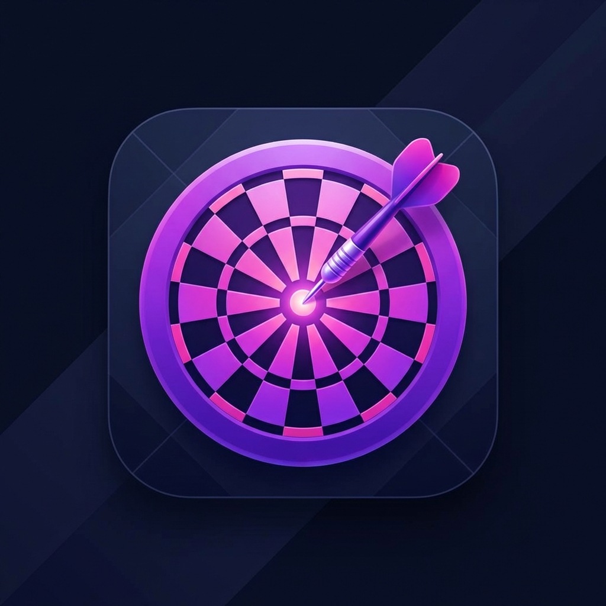

<p align="center">
  
</p>

# 🎯 Darts Party

Darts Party is a premium, standalone dart scoring application built with Vanilla JavaScript, HTML5, and Tailwind CSS. It provides a smooth, interactive experience for tracking scores across multiple game modes without the need for any complex setup or heavy frameworks.

## ✨ Features

- **Multi-Player Support**: Add up to 8 players with custom names and avatars.
- **Multiple Game Modes**:
  - 🎯 **501**: Standard race-to-zero game.
  - ⚓ **Cricket**: Close numbers 15-20 and Bull to win.
  - 💀 **Killer**: Eliminate opponents by hitting their assigned targets.
  - 🟦 **Tic-Tac-Toe**: Claim squares by hitting numbers 1-9.
- **Dynamic UI**:
  - 🌓 **Dark Mode**: High-contrast, premium dark interface.
  - 🔈 **Sound Effects**: Synthesized audio feedback for hits, wins, and milestones.
  - 🎊 **Confetti**: Interactive victory animations.
  - 🔄 **Undo System**: Revert the last 5 throws to correct mistakes.
- **Zero Dependencies**: Runs entirely in the browser using a single HTML file via CDNs for Tailwind and Lucide icons.

## 🚀 Getting Started

Simply open the `index.html` file in any modern web browser.

```bash
# No installation required! Just open the file:
open index.html
```

## 🛠️ Technology Stack

- **Vanilla JavaScript**: State management and dynamic DOM rendering.
- **Tailwind CSS**: Modern, responsive styling via Play CDN.
- **Lucide Icons**: Crisp, scalable iconography.
- **Web Audio API**: Real-time synthesized sound effects.
- **HTML5 Canvas**: High-performance particle animations (confetti).

## 🎮 How to Play

1. **Select Mode**: Choose your preferred darts game from the start screen.
2. **Setup Players**: Enter names and add up to 8 participants.
3. **Score**: Use the interactive number pad to record throws.
   - Use the **DOUBLE** and **TRIPLE** buttons to apply multipliers.
   - Use **UNDO** if you make a mistake.
4. **Win**: The app automatically detects win conditions for each game mode and celebrates with confetti!

## 📄 License

MIT License - feel free to use, modify, and share!
